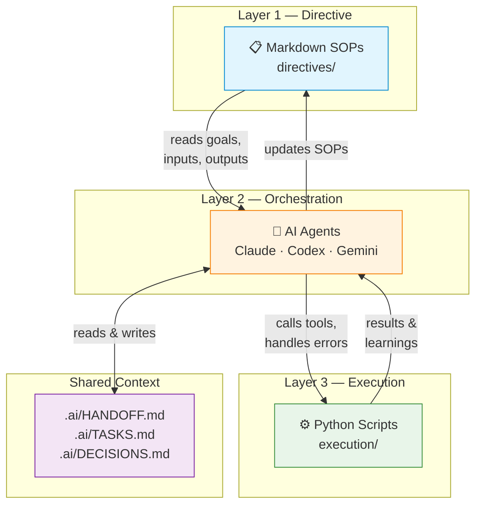

<p align="center">
  
</p>

<h1 align="center">🎵 Vibe Coding</h1>

<p align="center">
  <strong>Build products, not boilerplate — powered by multi-AI collaboration.</strong><br/>
  <sub>AI 3개가 협업하는 프로덕트 팩토리. 코드가 아니라 제품을 만듭니다.</sub>
</p>

<p align="center">
  
  
  
  
  
</p>

---

## 🤔 What is this? / 이게 뭔가요?

**Vibe Coding** is a multi-product workspace where three AI tools (Claude, Codex, Gemini) collaborate through a deterministic 3-layer architecture — Directive → Orchestration → Execution — to ship real products reliably. Instead of prompting an AI once and hoping for the best, every task flows through human-readable SOPs, AI-powered decision making, and battle-tested Python scripts.

**Vibe Coding**은 세 개의 AI 도구(Claude, Codex, Gemini)가 결정론적 3계층 아키텍처를 통해 실제 제품을 안정적으로 만들어내는 멀티 프로덕트 워크스페이스입니다. 지침(Directive) → 오케스트레이션(Orchestration) → 실행(Execution) 구조로 AI의 확률적 특성을 보완하여, 2,500개 이상의 테스트가 통과하는 프로덕션급 코드를 생산합니다.

---

## 🚀 Active Products

<table>
  <tr>
    <td align="center" width="33%">
      <h3>🐮 Joolife</h3>
      <sub>한우 농장 관리 대시보드</sub><br/><br/>
      
      <br/><br/>
      Premium Hanwoo farm management system with real-time market prices, smart calving/heat alerts, financial analysis, and full PWA support.<br/><br/>
      <a href="projects/hanwoo-dashboard/README.md">📄 View README →</a>
    </td>
    <td align="center" width="33%">
      <h3>🎬 Shorts Maker V2</h3>
      <sub>YouTube Shorts 자동 생성</sub><br/><br/>
      
      <br/><br/>
      5-channel YouTube Shorts pipeline with script generation, TTS, captioning, BGM, and MoviePy rendering. 8-LLM fallback router for reliability.<br/><br/>
      <a href="projects/shorts-maker-v2/">📄 View README →</a>
    </td>
    <td align="center" width="33%">
      <h3>🔍 Blind-to-X</h3>
      <sub>콘텐츠 인텔리전스 파이프라인</sub><br/><br/>
      
      <br/><br/>
      Content intelligence pipeline — scrapes trending posts, scores them across 8 dimensions, generates multi-LLM drafts, and queues to Notion for review.<br/><br/>
      <a href="projects/blind-to-x/README.md">📄 View README →</a>
    </td>
  </tr>
</table>

> **Also in the workspace:** [Knowledge Dashboard](projects/knowledge-dashboard/) (maintenance mode) · [Suika Game V2](projects/suika-game-v2/) · [Word Chain](projects/word-chain/)

---

## 🏗️ Architecture

The workspace runs on a **3-Layer Architecture** that separates concerns to maximize reliability:



**Why this works:** Each AI step at 90% accuracy drops to 59% over 5 steps. By pushing complexity into deterministic scripts and letting AI focus only on decisions, we keep reliability high.

---

## ⚡ Quick Start

### Prerequisites

| Tool | Version | Purpose |
|------|---------|---------|
| [Python](https://python.org) | 3.13+ | Execution layer |
| [Node.js](https://nodejs.org) | 20+ | Next.js projects |
| [uv](https://astral.sh/uv) | Latest | Python env management |
| [pnpm](https://pnpm.io) | 10+ | Node package management |

### Installation

```bash
# 1. Clone the repository
git clone https://github.com/biojuho/vibe-coding.git
cd vibe-coding

# 2. Create root venv and install uv
py -3 -m venv venv
venv\Scripts\python.exe -m pip install --upgrade pip uv

# 3. Sync workspace (control plane)
cd workspace
..\venv\Scripts\uv.exe sync
cd ..

# 4. Sync project environments
cd projects\blind-to-x
..\..\venv\Scripts\uv.exe sync
cd ..\..

cd projects\shorts-maker-v2
..\..\venv\Scripts\uv.exe sync
cd ..\..

# 5. Install Node dependencies (for Joolife dashboard)
cd projects\hanwoo-dashboard
pnpm install
cd ..\..
```

### Verify Installation

```bash
# Run workspace health check
cd workspace
..\venv\Scripts\uv.exe run scripts\doctor.py

# Run tests
..\venv\Scripts\uv.exe run pytest -q tests
```

---

## 🛠️ Technology Stack

| Category | Technology | Used In |
|----------|-----------|---------|
| **Frontend** | Next.js 16, React 19, Tailwind CSS | Joolife |
| **Backend** | Prisma 7, Supabase (PostgreSQL) | Joolife |
| **Automation** | Python 3.13, MoviePy, Edge TTS | Shorts Maker, Blind-to-X |
| **LLM Router** | Gemini · DeepSeek · xAI · OpenAI · Anthropic + 3 more | All pipelines |
| **Testing** | pytest, Vitest | All projects |
| **Linting** | Ruff (Python), ESLint (JS), Biome (formatting) | Workspace-wide |
| **AI Collaboration** | Claude Code, Codex, Gemini CLI | Orchestration layer |
| **Infra** | uv, pnpm, Turborepo | Monorepo management |

> Full stack policy: [`docs/technology-stack.md`](docs/technology-stack.md)

---

## 📁 Repository Structure

```
vibe-coding/
├── .ai/                    # Shared AI context (HANDOFF, TASKS, DECISIONS)
├── .agents/                # Agent skills & rules
├── workspace/              # Control plane — directives, execution, tests
│   ├── directives/         # 📋 Layer 1: Markdown SOPs
│   ├── execution/          # ⚙️ Layer 3: Deterministic Python scripts
│   └── tests/              # Workspace-level tests
├── projects/
│   ├── hanwoo-dashboard/   # 🐮 Joolife — Next.js farm dashboard
│   ├── shorts-maker-v2/    # 🎬 Shorts Maker — video automation
│   ├── blind-to-x/         # 🔍 Blind-to-X — content intelligence
│   ├── knowledge-dashboard/# 📊 Knowledge Dashboard (maintenance)
│   └── ...
├── infrastructure/         # MCP servers & shared services
└── docs/                   # Workspace documentation
```

---

## 🧪 Testing

All projects maintain high test coverage. Tests must pass before any PR is merged.

```bash
# Workspace tests
cd workspace
..\venv\Scripts\uv.exe run pytest -q tests
..\venv\Scripts\uv.exe run pytest -q execution\tests

# Blind-to-X tests (1,622+ tests)
cd projects\blind-to-x
..\..\venv\Scripts\uv.exe run pytest -q

# Shorts Maker V2 tests (602+ tests)
cd projects\shorts-maker-v2
..\..\venv\Scripts\uv.exe run pytest -q

# Joolife tests (282+ tests)
cd projects\hanwoo-dashboard
pnpm test
```

---

## 🤝 Contributing

We welcome contributions! Please read our [Contributing Guide](CONTRIBUTING.md) before submitting a PR.

**TL;DR:**
1. Fork & create a feature branch
2. Follow existing code style (Ruff / ESLint / Biome)
3. Add tests for new functionality
4. Ensure all tests pass
5. Submit a PR with a clear description

---

## 📄 License

This project is licensed under the **MIT License** — see the [LICENSE](LICENSE) file for details.

---

<p align="center">
  <sub>Built with ☕ and 🎵 vibes by <a href="https://github.com/biojuho">박주호 (Juho Park)</a></sub>
</p>
